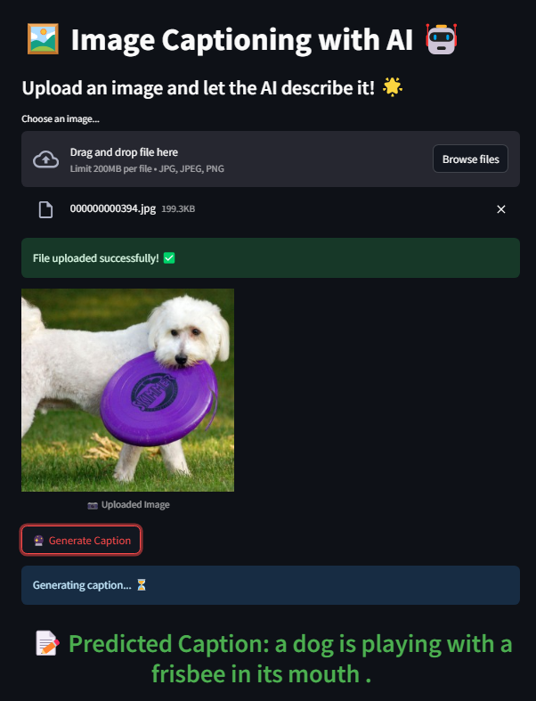

# Automatic Image Captioning using PyTorch on COCO Dataset

## Project Overview

In this project, I'll create a neural network architecture consisting of both CNNs (Encoder) and LSTMs (Decoder) to automatically generate captions from images.
The network will be trained on the Microsoft Common Objects in COntext [(MS COCO)](http://cocodataset.org/#home) dataset. The image captioning model is displayed below.

 [Image source](https://arxiv.org/pdf/1411.4555.pdf)


### Setting Up the Environment

1. **Clone the Repository:**
   ```bash
   git clone https://github.com/iamirmasoud/image_captioning.git
   cd image_captioning
   ```

2. **Create and Activate Environment:**
   ```bash
   conda create -n captioning_env python=3.7
   source activate captioning_env
   ```

3. **Install Dependencies:**
   ```bash
   pip install -r requirements.txt
   ```


## Dataset
### About MS COCO dataset
The Microsoft COCO dataset is a large-scale resource for scene understanding, commonly used to train and benchmark object detection, segmentation, and captioning algorithms.


1. Download some specific data from here: http://cocodataset.org/#download (described below)

* **Annotations**:
  * **2017 Train/Val annotations**  
  * **2017 Testing Image info** 

* **Images**:
  * **2017 Train images**
  * **2017 Val images**

## Jupyter Notebooks

 The implementations of the EncoderCNN and DecoderRNN are found in the [model.py](model.py) file.

The core architecture used to achieve this task follows an encoder-decoder architecture, where the encoder is a pretrained ResNet CNN on ImageNet, and the decoder is a basic one-layer LSTM.

#### Architecture Details


### 1. **CNN Encoder:**
   - The CNN encoder, a pre-trained ResNet, extracts both low-level and high-level features from the input image, converting them into a feature vector. The last fully connected layer of ResNet is replaced with a trainable fully connected layer to adapt the feature map for the RNN decoder. This layer is trained from scratch to ensure that the output encoding is suitable for the sequential nature of the caption generation task.

### 2. **RNN Decoder:**
   - The RNN decoder, specifically an LSTM, takes the feature vector from the CNN encoder and uses it as the initial input, concatenated with a "START" token. The LSTM leverages both short-term and long-term memory to generate a caption word by word. At each time step, the hidden state is passed through a fully connected layer to produce a probability distribution over the vocabulary. The word with the highest probability is selected as the output and is fed back into the LSTM as input for the next time step. This process continues until the model generates a "STOP" token or reaches the maximum caption length.

### Additional Details:
   - **Embedding and Hyperparameters:** Each word and the feature vector are embedded to a consistent size (`embed_size`). Initial hyperparameters were adjusted based on training performance: the embedding size was set to 256, hidden size to 512, and a minimum word count threshold of 5. The model was retrained with these settings for better performance, showing improvement after reducing overfitting.
   - **Trainable Parameters:** The last layer of ResNet was made trainable while the rest of the network was frozen to speed up training. The entire RNN decoder, which is not part of the pre-trained ResNet, was trained from scratch.
   - **Optimizer:** The Adam optimizer was chosen to minimize `CrossEntropyLoss` due to its effectiveness in combining several optimization techniques.
   - **Inference:** During inference, the trained model is used to generate captions for new images. The model's performance is observed through sample captions rather than rigorous validation metrics.

### Deploy and Share Image Captioning Service Using Streamlit

The interactive image captioning service is deployed using Streamlit, a tool that simplifies the creation of web apps with minimal code. It supports interactive elements such as file uploads and text inputs, making it easy to showcase machine learning models.

To deploy the app, ensure that the `cocoapi_dir` and paths to the encoder and decoder models are correctly set. Then, run the following command:

```bash
streamlit run app.py
```

This will open the image captioning service in the browser, allowing users to upload images and view generated captions in real-time.


